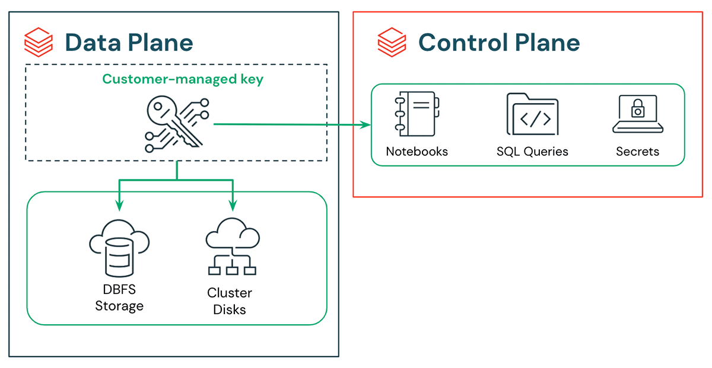

# Topics covered in the document...

1. [What is Databricks and its architecture?](#1-what-is-databricks-and-its-architecture?)
2. [Databricks workspace navigation](#2-databricks-workspace-navigation)
3. [Clusters: creation, configuration, and management](#3-clusters-creation-configuration-and-management)
4. [Notebooks: creating, organizing, and sharing](#4-notebooks-creating-organizing-and-sharing)
5. [Databricks Runtime and Unity Catalog overview](#5-databricks-runtime-and-unity-catalog-overview)

## 1. What is Databricks and its architecture?

### Answer
Databricks is a unified data analytics platform built on top of Apache Spark. It's a cloud-based platform that provides a collaborative environment for data engineers, data scientists, and analysts to work together on big data and machine learning projects.

Key Purpose: Databricks simplifies big data processing and makes it easier to build data pipelines, perform analytics, and create machine learning models at scale.

### Architecture

The Databricks architecture consists of two main planes:

#### 1. Control Plane (Managed by Databricks)
- Web Application/UI: The interface where you interact with Databricks.
- Cluster Manager: Manages cluster lifecycle (creation, termination, scaling)
- Notebook Server: Hosts collaborative notebooks
- Jobs scheduler: Orchestrates and schedules workflows
- Security & Access Control: Manages authentication and authorization
- Metadata Store: Stores information about databases, tables, and configurations

#### 2. Data Plane (Runs in Your Cloud Account)
- Compute Clusters: Apache Spark clusters that executes your code
  - Driver node (coordinates work)
  - Worker nodes (execute tasks)
- Cloud Storage: Where your actual data lives (S3, ADLS, GCS)
- Delta Lake Storage: Optimized storage layer with ACID transactions
###

### Key Architectural Components
Workspaces: Isolated environments for organizing notebooks, libraries, and dashboards.

#### Clusters:
        - All-Purpose Clusters: Interactive work, development
        - Job Clusters: Automated production workloads (cost-effective)

- Notebooks: Interactive documents supporting Python, Scala, SQL, and R
- Delta Lake: Storage layer that brings reliability to data lakes (ACID transactions, time travel, schema enforcement)
- Unity Catalog: Centralized governance and metadata management across all workspaces
- DBFS (Databricks File System): Abstraction layer over cloud storage
## 2. Databricks Workspace Navigation

### Answer

## 3. Clusters: Creation, Configuration, and Management

### Answer

## 4. Notebooks: Creating, Organizing, and Sharing

### Answer

## 5. Databricks Runtime and Unity Catalog Overview

### Answer